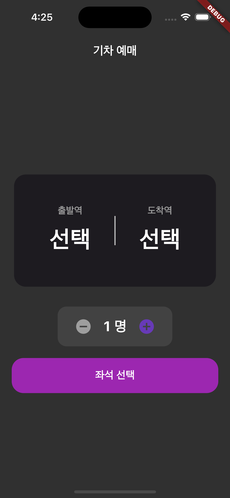

🚂 Flutter Train App

🚀 프로젝트 개요
Flutter Train App은 간단한 기차표 예매 과정을 시뮬레이션하는 모바일 애플리케이션입니다. 사용자 친화적인 인터페이스를 제공하며, 출발역 및 도착역 선택, 인원수 지정, 좌석 선택 등의 기능을 포함하고 있습니다. 이 프로젝트는 Flutter를 이용한 UI 구현 및 기본적인 상태 관리, 화면 간 데이터 전달, 다크 모드 적용 등의 학습 목적으로 개발되었습니다.

✨ 주요 기능
출발역/도착역 선택: 사용자가 원하는 출발역과 도착역을 선택할 수 있습니다.

중복 선택 방지: 출발역을 선택한 후에는 도착역 목록에서 해당 역이 제외됩니다 (그 반대의 경우도 동일).

예약 인원 선택: 최대 4명까지 예약 인원을 지정할 수 있습니다.

좌석 선택: 비행기 좌석 배치와 유사한 그리드 형태의 좌석 배치도에서 원하는 좌석을 선택할 수 있습니다.

선택된 좌석은 보라색으로 표시됩니다.

예약 인원과 선택된 좌석 수가 일치하지 않으면 메시지가 표시됩니다.

예매 확인 다이얼로그: "예매 하기" 버튼을 누르면 선택된 좌석 정보와 함께 예매 확인 다이얼로그가 나타납니다.

취소 시 다이얼로그 닫기.

확인 시 예매 완료 처리 후 메인 화면으로 돌아갑니다.

다크 모드 지원: 앱 전체에 다크 모드 테마가 기본으로 적용되어 있어, 저녁 시간에도 편안하게 사용할 수 있습니다.

반응형 UI: 다양한 화면 크기(특히 iPhone 15 Pro와 같은 최신 기기)에서도 UI가 깨지지 않고 중앙에 잘 정렬되도록 최적화되었습니다.

🛠️ 기술 스택
Flutter: 크로스 플랫폼 모바일 애플리케이션 개발 프레임워크

Dart: Flutter의 프로그래밍 언어

Material Design: UI/UX 디자인 가이드라인

Cupertino Design: iOS 스타일의 위젯 (CupertinoAlertDialog 등)

📁 프로젝트 구조
flutter_train_app/
├── lib/
│   ├── main.dart             # 앱 진입점 및 전역 테마 설정
│   ├── home_page.dart        # 출발/도착역 선택 및 인원수 선택 초기 화면
│   ├── station_list_page.dart# 기차역 목록을 보여주고 선택하는 화면
│   └── seat_page.dart        # 좌석 선택 화면 및 예매 로직
├── pubspec.yaml              # 프로젝트 종속성 관리
├── README.md                 # 현재 파일
└── ...
⚙️ 설치 및 실행 방법
이 프로젝트를 로컬 환경에서 실행하기 위한 단계별 지침입니다.

1. Flutter SDK 설치

Flutter가 설치되어 있지 않다면, Flutter 공식 문서를 참조하여 설치해주세요.

2. 프로젝트 클론 (또는 다운로드)

Bash
git clone https://github.com/your-username/flutter_train_app.git
cd flutter_train_app
(만약 GitHub에 프로젝트를 올리지 않았다면, 이 부분은 "프로젝트 파일 다운로드" 등으로 변경해주세요.)

3. 종속성 설치

프로젝트 폴더에서 다음 명령어를 실행하여 필요한 패키지들을 설치합니다.

Bash
flutter pub get

4. 앱 실행

에뮬레이터 또는 실제 디바이스를 연결한 후, 다음 명령어를 실행하여 앱을 빌드하고 실행합니다.

Bash
flutter run

5. (선택 사항) 빌드 클린

만약 빌드 관련 문제가 발생하면 다음 명령어로 빌드 캐시를 정리한 후 다시 시도해보세요.

Bash
flutter clean
flutter pub get
flutter run
💡 개발 과정에서 배운 점
MaterialApp의 theme, darkTheme, themeMode를 활용한 전역 테마 관리.

ScaffoldBackgroundColor, CardColor, AppBarTheme 등 ThemeData의 다양한 속성 활용.

Navigator.push를 통한 화면 전환 및 데이터(출발/도착역, 인원수) 전달.

StatefulWidget을 이용한 동적인 UI (좌석 선택, 인원수 증감).

GridView.builder를 이용한 유연한 그리드 레이아웃 구현.

SingleChildScrollView, Center, Column, Row 위젯의 조합을 통한 복잡한 레이아웃 정렬 문제 해결.

SnackBar에 SnackBarAction을 추가하여 사용자 상호작용성 개선.

showCupertinoDialog를 이용한 iOS 스타일 다이얼로그 구현.

🤝 기여 방법
이 프로젝트는 학습 목적으로 시작되었지만, 개선을 위한 여러분의 기여를 환영합니다!
버그 리포트, 기능 제안, 코드 개선 등에 참여하고 싶으시다면 언제든지 Issues를 열거나 Pull Request를 제출해주세요.